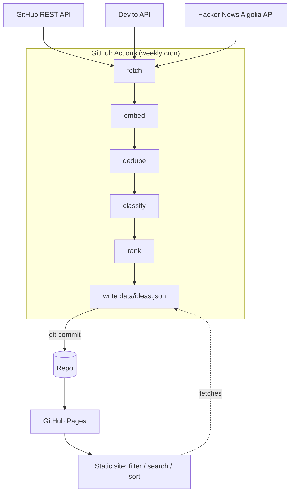

# IdeaForge 🔨

> An automated aggregator of programming project ideas — scraped, deduplicated, classified, and ranked. Deployed as a **free** static site with **zero ongoing hosting cost**.

**Live demo:** _<!-- TODO: add GitHub Pages URL once deployed -->_

 <!-- TODO: add screenshot -->

---

## Why this exists

Every aspiring developer hits the same wall: *"What should I build?"* The answer is scattered across GitHub topic pages, Dev.to articles, Reddit threads, and listicles — full of duplicates, dead links, and no sense of which ideas are actually worth doing or how hard they are.

**IdeaForge** solves this by continuously aggregating project ideas from multiple sources, then:

- **Deduplicating** the same idea appearing in many places (semantic similarity, not just string match)
- **Classifying** difficulty (beginner / intermediate / advanced) and domain (web / cli / ml / …)
- **Ranking** by recency, cross-source validation, and engagement signals
- Surfacing it all in a fast, filterable, searchable static site

An idea that shows up across GitHub *and* Dev.to is more validated than one mentioned once — the pipeline treats that as a ranking signal rather than noise.

## Architecture

Everything runs for free: free API tiers + GitHub Actions free tier + GitHub Pages. There is **no persistent backend** — the "database" is a committed JSON file.



### Pipeline stages

| Stage | File | What it does |
|-------|------|--------------|
| **fetch** | `scraper/sources/*.py` | Pull raw ideas from each source, normalize to a common schema. Each source is wrapped in `try/except` so one failure can't break the run. |
| **embed** | `scraper/embed.py` | Compute sentence-transformer embeddings (`all-MiniLM-L6-v2`, runs on CPU) for each idea's title + description. |
| **dedupe** | `scraper/dedupe.py` | Cluster ideas with cosine similarity above a threshold (default `0.85`), merge duplicates, keep the best-written version and collect all source links. |
| **classify** | `scraper/classify.py` | Rule-based difficulty tagging + tag normalization (`webapp`/`web app`/`website` → `web`) and domain inference. |
| **rank** | `scraper/rank.py` | Score = f(recency, source diversity, engagement). |
| **write** | `scraper/pipeline.py` | Emit clean `data/ideas.json`. |

### How dedup works

1. Each idea is embedded into a 384-dim vector from its title + description.
2. Pairwise cosine similarity is computed; ideas above the threshold are grouped into clusters (greedy connected-components).
3. Within a cluster, the "best" representative is chosen (longest well-formed description) and the rest are merged in — their source links and engagement signals are preserved on the surviving idea.

The threshold (`0.85`) is tunable. During development the dedupe stage prints cluster examples so it can be tuned by eye.

### How ranking works

A simple weighted heuristic:

- **Recency** — newer `last_seen` scores higher (decay over time).
- **Source diversity** — an idea validated across multiple platforms scores higher than a single-source idea.
- **Engagement** — GitHub stars / Dev.to reactions where available, normalized per source.

## Data model

Each idea in `data/ideas.json`:

```jsonc
{
  "id": "sha1-of-normalized-title",
  "title": "Build a URL shortener",
  "description": "...",
  "difficulty": "beginner",            // beginner | intermediate | advanced
  "tags": ["web", "api"],
  "domain": "web",                      // web | mobile | cli | ml | data | game | ...
  "sources": [
    { "platform": "github", "url": "https://...", "engagement_score": 1240 },
    { "platform": "devto",  "url": "https://...", "engagement_score": 37 }
  ],
  "score": 0.82,                        // computed rank
  "first_seen": "2026-06-01",
  "last_seen": "2026-06-25"
}
```

## Sources

| Source | Auth | Topics / tags / queries used |
|--------|------|------------------------------|
| GitHub REST API | `GH_TOKEN` (free; works unauthenticated at a lower rate limit) | topics: `project-ideas`, `beginner-projects`, `hacktoberfest-ideas`, `app-ideas`, `project-based-learning`, `coding-challenges` |
| Dev.to public API | none | tags: `beginners`, `projectideas`, `showdev`, `100daysofcode`, `tutorial` |
| Hacker News (Algolia) | none | queries: `project ideas`, `side project ideas`, `programming projects for beginners`, `what should I build` (stories ≥ 20 points) |
| Reddit (public JSON) | **disabled by default** | implemented in `scraper/sources/reddit.py` but not wired in — see below |

A typical run yields **~500–600 unique ideas** after dedup + filtering.

> **Reddit is implemented but disabled.** Reddit now blocks unauthenticated / datacenter traffic with HTTP 403 (verified locally; certain to fail on GitHub Actions IPs), so it needs OAuth credentials to be reliable — the app-registration step originally deferred. The module is kept as a reference; re-enable it by adding OAuth auth and putting `("reddit", reddit.fetch)` back in `pipeline.run_fetch`.

## Project structure

```
scraper/
  sources/
    github.py        # GitHub REST API fetcher
    devto.py         # Dev.to API fetcher
    hackernews.py    # Hacker News (Algolia) fetcher
    reddit.py        # Reddit fetcher (disabled by default — needs OAuth)
  embed.py           # sentence-transformers embeddings
  dedupe.py          # semantic clustering + merge
  classify.py        # difficulty + tag/domain normalization
  rank.py            # scoring heuristic
  pipeline.py        # orchestrates fetch->embed->dedupe->classify->rank->write
site/
  index.html         # static frontend
  app.js             # fetch + filter/search/sort/dark-mode
  style.css
data/
  ideas.json         # generated, committed by CI
.github/workflows/
  update.yml         # weekly cron: run pipeline, commit data, deploy Pages
tests/
  test_dedupe.py     # dedupe logic (fixture data, no live APIs)
  test_classify.py   # classification heuristics
requirements.txt
README.md
```

## Setup

Requires **Python 3.11**.

```bash
# 1. Install dependencies
pip install -r requirements.txt

# 2. Set a GitHub token (free, for the GitHub source)
export GH_TOKEN=ghp_xxx          # Windows PowerShell: $env:GH_TOKEN="ghp_xxx"

# 3. Run the full pipeline locally
python -m scraper.pipeline

# 4. Serve the static site locally (from the repo root, so /site and /data are both served)
python -m http.server 8000
# open http://localhost:8000/site/
```

> The frontend tries `data/ideas.json` first and falls back to `../data/ideas.json`,
> so it works both when served from the repo root (local dev) and from the
> assembled Pages artifact (where CI copies `ideas.json` in beside `index.html`).

> **Python version:** the pipeline targets **3.11** (pinned in CI). It also runs
> on newer 3.x locally — only the standard library + the listed deps are used.

### GitHub Actions setup

The weekly workflow needs the GitHub token as a repo secret:

> ⚠️ **Add your token under repo Settings → Secrets and variables → Actions → New repository secret, named `GH_TOKEN`.** Never hardcode the token in the workflow or commit it.

GitHub Pages must be enabled under **Settings → Pages** (source: GitHub Actions, or the branch/folder serving `site/`).

## Running tests

```bash
pytest
```

Tests use fixture data only — no live API calls.

## Constraints / design notes

- **No paid APIs or services anywhere** in the stack.
- Runs entirely within free tiers (APIs + Actions + Pages).
- MiniLM runs fine on CPU — no GPU needed in CI.
- Each source fetch is isolated with `try/except`.

## Roadmap / known limitations (v1)

- **Reddit source** — implemented (`scraper/sources/reddit.py`) but disabled: Reddit
  blocks unauthenticated/datacenter traffic (403), so it needs OAuth to be reliable.
  Re-enable by adding OAuth auth and wiring it back into `pipeline.run_fetch`.
- **Cross-run history** — v1 rebuilds `ideas.json` from scratch each run, so
  `first_seen`/`last_seen` reflect source *publish* dates, not first/last time we
  scraped an idea. Persisting history would mean merging against the previous
  `ideas.json` before writing.
- **Dev.to content quality** — the `beginners`/`showdev` tags surface some
  narrative/show-and-tell posts rather than buildable idea-prompts. A conservative
  relevance filter drops the obvious non-ideas; GitHub topic repos are the stronger
  idea source. Tightening this filter (or weighting GitHub higher) is a tuning knob.
- **Dedup threshold** is tuned by eye to `0.85` (conservative — avoids merging
  distinct ideas that merely share a theme). Re-tune as the corpus grows.

## License

MIT _(TODO: add LICENSE file)_
